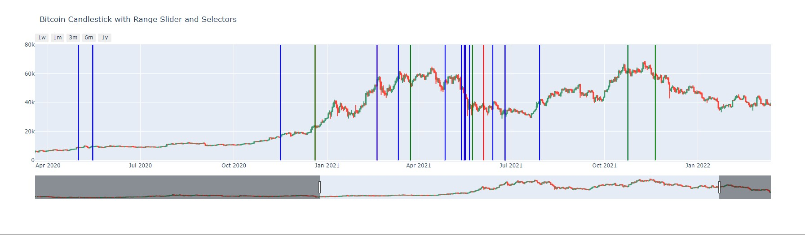

# Analyze tweets on a given topic and show on datetime chart



## Requirements
```bash
1. Transformers
2. pandas_datareader
```

## Pipeline
```bash
0. Get cryptocurrency/company value from e.g yahoofinance
1. Get tweets e.g Elon Musks tweets from kaggle
2. Preprocess data
3. Get sentimental analysis using Transformers
positive - green
neutral - blue
negative - red
4. Plot chart
```
